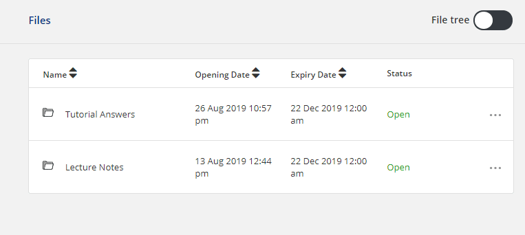
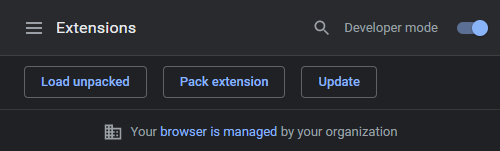
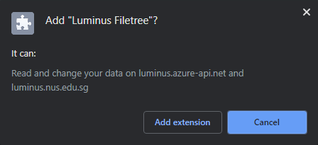

# Luminus Filetree

### **Only works and tested for NUS students**

Luminus Filetree adds a filetree view option onto the existing default files view for quicker overview of files listing. It also eases file/folder downloads by allowing one click download.

This is inspired by the phased out IVLE filetree (the "Download Manager" button) and I just want to make life easier wherever I can :blush:

## Usage

1. Toggle filetree using the checkbox
2. 1-click download any files/folders

## Installation

Download from [latest release](https://github.com/hidingmode/luminus-filetree/releases/latest)

### Firefox

For Firefox, download the .xpi file, drag and drop it into about:addons page.

### Chrome on Windows

1. Add the extension id to the whitelist registry by running (download and double click) [chrome-extension-whitelist.reg](chrome-extension-whitelist.reg).
   - Alternatively, add the extension id `dgogmggogdegmllmfjlkhcdfmecmkhac` to `HKEY_LOCAL_MACHINE\SOFTWARE\Policies\Google\Chrome\ExtensionInstallWhitelist`.
   - This is a workaround for Chrome's restrictions on installing extensions from external sources not from Chrome WebStore.
2. Download the .crx file.
3. Go to chrome://extensions page and enable developer mode with the toggle on the top right.

   - "Your browser is managed by your organization" shows up because of the registry workaround. Don't worry about it. Feel free to download the source code and package it yourself if you don't trust me lol.
3. Drag and drop it into chrome://extensions page. A popup will appear. Click on Add extension.

### Chrome on MacOS/Linux (This hasn't been tested, inform me if you face any issues)

1. Follow instructions on [installing using a preferences file](https://developer.chrome.com/extensions/external_extensions#preferences), setting the `external_update_url` as `https://raw.githubusercontent.com/davidchoo12/luminus-filetree/master/chrome-update-manifest.xml`.
2. Download the .crx file.
3. Drag and drop it into chrome://extensions page. A popup will appear. Click on Add extension.

## Motivation

### Limited API authentication mechanism
As the Luminus API [doesn't provide authentication mechanism for third party apps](https://wiki.nus.edu.sg/pages/viewpage.action?pageId=201035429) as of 18 Aug 2019, the only way to access its services is through the official Luminus portal. So third party apps (like these homemade apps by students) have to go through the authentication flow from Luminus portal to gain access to the API.

This makes it difficult to create an autodownloader unless we somehow trick the API that we have authenticated through the portal. Also, authentication through the portal is short term (sessions expire in 8 hours I believe). So a hypothetical autodownloader will have to reauthenticate every 8 hours.

### Personal preference
I used to use the filetree in IVLE a lot, allowing me to download many files easily and selectively.

## How it works
1. background.js is triggered when a user navigates to the files tab in Luminus
2. background.js initiates content scripts and forwards access token (the Authorization HTTP header) to content.js
3. content.js traverses the [files](https://luminus.portal.azure-api.net/docs/services/Files/operations/GetFiles) and [folders](https://luminus.portal.azure-api.net/docs/services/Files/operations/GetFolders), while getting download links to generate a filetree data
4. content.js adds html elements to the page and uses [fancytree](https://github.com/mar10/fancytree) to display the filetree

## Feature/improvement ideas
- [x] Icons to indicate new undownloaded files (like the red icons in IVLE)
- [x] Download all button
- [ ] Expand/collapse all buttons
- [ ] Table/grid view to show metadata (date modified, author, etc) in columns
- [ ] Styling fixes (background and font colors) for working with dark reader extension

Feel free to submit feature requests through the issues tab.

## Contributing
Pull requests are welcome. For major changes, please open an issue first to discuss what you would like to change.

Learning sources
- [Firefox Extensions tutorial](https://developer.mozilla.org/en-US/docs/Mozilla/Add-ons/WebExtensions/Your_first_WebExtension)
- [Chrome Extensions tutorial](https://developer.chrome.com/extensions/getstarted)

## License
[MIT](https://choosealicense.com/licenses/mit/)
