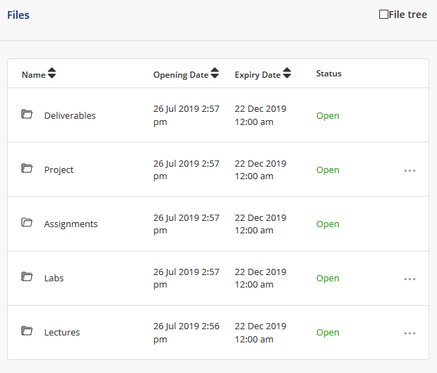
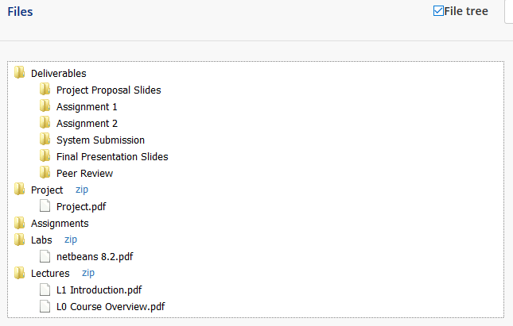

# Luminus Filetree

### **Only works and tested for NUS students**
### **Currently only supports Firefox**

Luminus Filetree adds a filetree view option onto the existing default files view for quicker overview of files listing. It also eases file/folder downloads by providing direct download links.

This is inspired by the phased out IVLE filetree (the "Download Manager" button) and I just want to make life easier wherever I can :smile

## Installation

Download from [latest release](https://github.com/hidingmode/luminus-filetree/releases/latest)

For Firefox, download the .xpi file, drag and drop it into Firefox.

For Chrome, download the .crx file, drag and drop it into Chrome.

## Usage

Default view

Click the checkbox on top right to toggle filetree.

Click on the zip links to download folders and the file names to download files.

## Motivation

### Limited API authentication mechanism
As the Luminus API [doesn't provide authentication mechanism for third party apps](https://wiki.nus.edu.sg/pages/viewpage.action?pageId=201035429) as of 18 Aug 2019, the only way to access its services is through the official Luminus portal. So third party apps (like these homemade apps by students) have to go through the authentication flow from Luminus portal to gain access to the API.

This makes it difficult to create an autodownloader unless we somehow trick the API that we have authenticated through the portal. Also, authentication through the portal is short term (sessions expire in 8 hours I believe). So a hypothetical autodownloader will have to reauthenticate every 8 hours.

### Personal preference
I used to use the filetree in IVLE a lot, allowing me to download many files easily and selectively.

## How it works
1. background.js is triggered when a user navigates to the files tab in Luminus
2. background.js initiates content scripts and forwards access token (the Authorization HTTP header) to content.js
3. content.js traverses the [files](https://luminus.portal.azure-api.net/docs/services/Files/operations/GetFiles) and [folders](https://luminus.portal.azure-api.net/docs/services/Files/operations/GetFolders), and getting download links to generate a filetree data (I wasn't aware of the [GetAllFiles](https://luminus.portal.azure-api.net/docs/services/Files/operations/GetAllFiles) operation, so this step may change)
4. content.js adds html elements to the page and uses [fancytree](https://github.com/mar10/fancytree) to display the filetree

## Feature/improvement ideas
- [ ] Try the [GetAllFiles](https://luminus.portal.azure-api.net/docs/services/Files/operations/GetAllFiles) operation, if works, replace the traversal script
- [ ] Icons to indicate new undownloaded files (like the red icons in IVLE)
- [ ] Download all button
- [ ] Expand/collapse all buttons
- [ ] Table/grid view to show metadata (date modified, author, etc) in columns
- [ ] Cache download links in local storage to speed up loading time

Feel free to submit feature requests through the issues tab.

## Contributing
Pull requests are welcome. For major changes, please open an issue first to discuss what you would like to change.

Learning sources
- [Firefox Extensions tutorial](https://developer.mozilla.org/en-US/docs/Mozilla/Add-ons/WebExtensions/Your_first_WebExtension)
- [Chrome Extensions tutorial](https://developer.chrome.com/extensions/getstarted)

## License
[MIT](https://choosealicense.com/licenses/mit/)